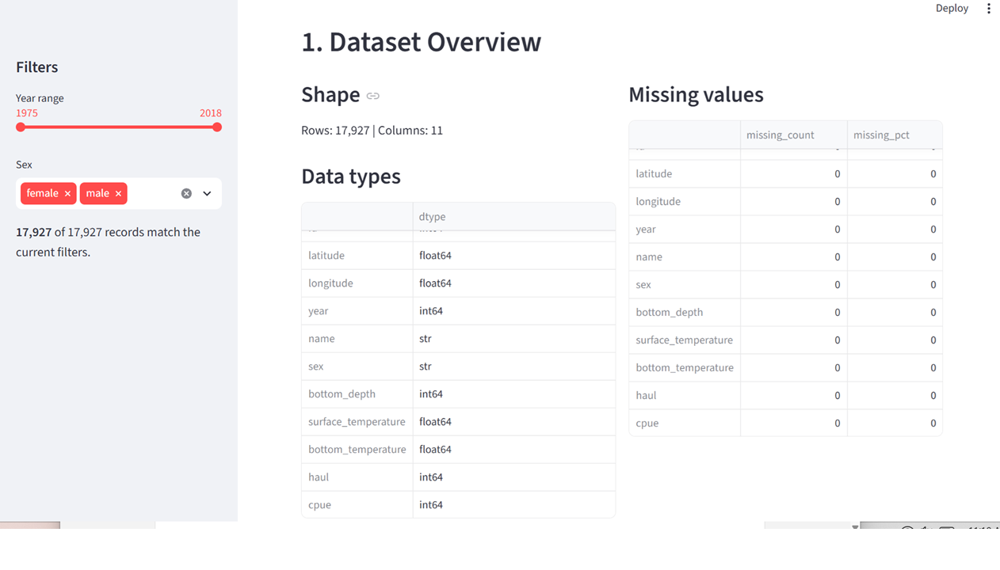
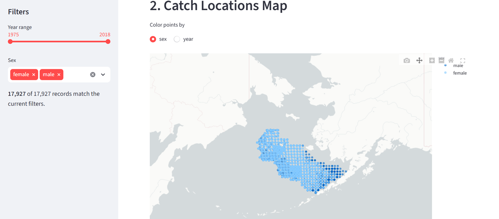
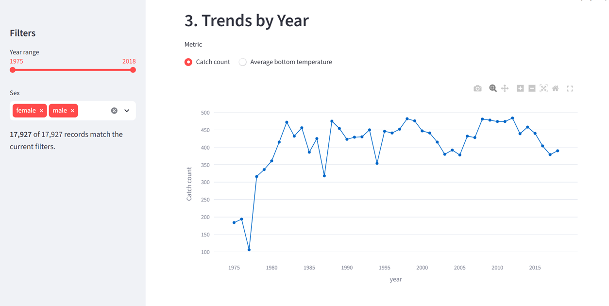
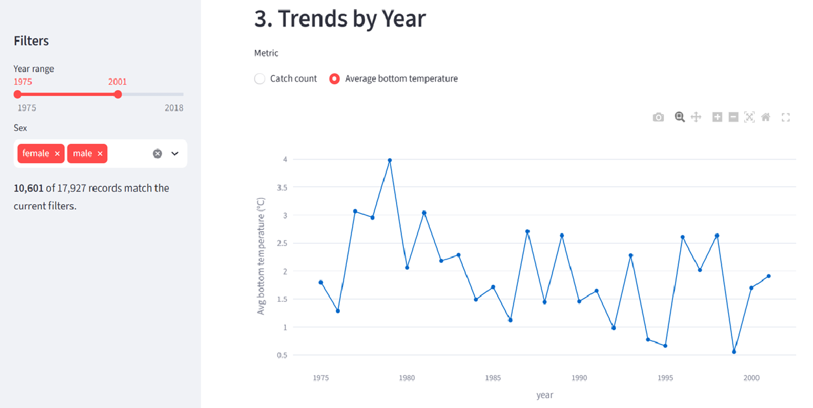

# Snow Crab Streamlit App

An interactive Streamlit dashboard for exploring Alaskan snow crab catch survey data (1975-2018).

## Data

`mfsnowcrab.csv` contains snow crab catch records with the following columns:

| Column | Description |
| --- | --- |
| `id` | Record identifier |
| `latitude` / `longitude` | Catch location |
| `year` | Survey year |
| `name` | Species name |
| `sex` | Crab sex (`male` / `female`) |
| `bottom_depth` | Sea floor depth at haul location |
| `surface_temperature` | Surface water temperature |
| `bottom_temperature` | Bottom water temperature |
| `haul` | Haul identifier |
| `cpue` | Catch per unit effort |

## Features

- Dataset overview: shape, dtypes, missing values, summary statistics
- Map of catch locations, colored by sex or year
- Yearly trend chart (catch count or average bottom temperature)
- Histograms of bottom depth and bottom temperature
- Sex ratio breakdown (pie or bar chart)
- Sidebar filters for year range and sex

## Screenshots

**Dataset overview** — shape, column dtypes, and missing-value counts for the loaded CSV.


**Catch locations map** — every haul plotted by latitude/longitude and colored by sex.


**Trends by year** — catch count per year across the full 1975-2018 survey period.


**Sidebar filters** — year range and sex filters narrowed to 1975-2001, updating the average bottom temperature trend accordingly.


## Setup

This project uses [uv](https://docs.astral.sh/uv/) for dependency management.

1. [Install uv](https://docs.astral.sh/uv/getting-started/installation/) if you don't already have it.
2. Clone this repository and move into it:

   ```bash
   git clone https://github.com/12329661/snow-crab-streamlit-app.git
   cd snow-crab-streamlit-app
   ```

3. Install dependencies (uv creates a `.venv` and installs everything from `uv.lock`):

   ```bash
   uv sync
   ```

## Run

```bash
uv run streamlit run app.py
```

Streamlit will start a local server and print a URL (typically http://localhost:8501) — open it in your browser.
